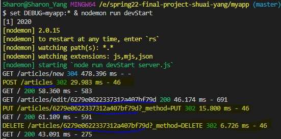

This JavaScript application performs CRUD(Create, Read, Update, and Delete) operations for blog posts.  
It was built from scratch purly with NodeJS, Express and my own custom style sheet without using bootstrap or any prebuilt framework such as React. 
It interacts with a MongoDB to store and retrieve data.

## How to run this website

In myapp directory:

- npm install
- node ./bin/www
   (on Windows, use command: > set DEBUG=myapp:\* & npm start)

Browse to localhost:3000

## Features

1. The website presents top navigation on all created pages in a consistent format and the navigation color changes while navigating to another bar.
2. Wrote my own css styles from scratch.
3. I used Mongo database, particularly the mongoose id, slug generator, and schema.
4. The framework was inherited from the given starter code(NodeJS and Express) and customized to meet my database selection and server building.
5. The functions of this website include addition, deletion and edition. The methods I used include GET, POST, PUT, and DELETE.
